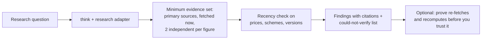
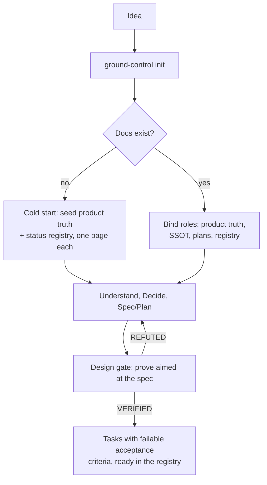
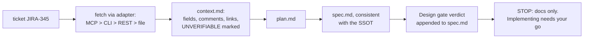
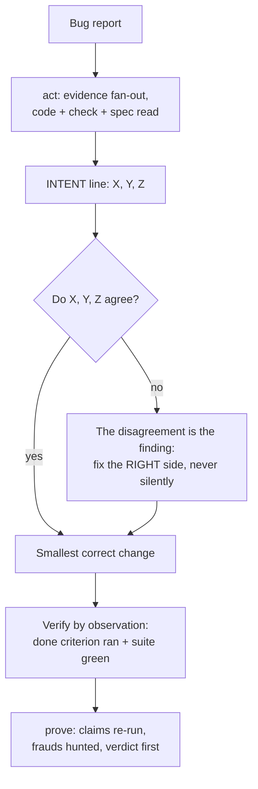

<p align="center"></p>

# major-tom

The Fable Workflow for Claude Code: **think**, **act**, **prove**, **ground-control**. A per-task problem-solving loop, its orchestration, an adversarial work-verifier, and a project-scale process that conducts them all.

What makes this repo different is not the method, it is the receipts: **it ships its own eval, failures included**. Sixteen rounds, published nulls, and a process whose Verify gate refuted its own author's work (12 reproduced findings) before that work was allowed to merge. Every rule in these skills traces to a round that made it necessary.

## Install

```bash
# from the marketplace in this repo
/plugin marketplace add websublime/major-tom
/plugin install major-tom@major-tom

# or, for local development
claude --plugin-dir path/to/major-tom
```

Installing brings: the four skills (namespaced: `/major-tom:think`, `/major-tom:act`, `/major-tom:prove`, `/major-tom:ground-control`), nine role agents for ground-control teams, and the discipline hooks. **Disclosure**: the hooks are self-gated; they act only inside git repos whose root carries a ground-control binding (`docs/PROCESS.md` starting with `# Process binding`) and stay inert everywhere else. The `gc-violations` monitor is an experimental Claude Code component (v2.1.105+). `jq` is optional: the branch guard falls back to a conservative parser and fails closed without it.

## The commands

| Command | What it is | Modes |
|---|---|---|
| `/major-tom:think` | The per-task loop: classify the ask, define done, gather evidence, decide, act surgically, verify by observation, report outcome-first. Domain adapters for marketing, research, data, business, finance, legal, design. | `plan` (stop after the plan), `audit` (grade finished work against the loop), `report` (rewrite an answer outcome-first) |
| `/major-tom:act` | The orchestrated version of think for non-trivial tasks: parallel evidence subagents, one committed plan, execution with an intent gate, adversarial verification agents. | one loop, four stages |
| `/major-tom:prove` | The judge. Treats any "done" as a set of claims: re-runs the claimed verifications, diffs what actually changed, hunts the fraud tables, returns VERIFIED / VERIFIED WITH CAVEATS / REFUTED. | `suite <target>` (run the trap suite against a skill or model) |
| `/major-tom:ground-control` | The project-scale process: lifecycle with adversarial gates, an orchestrator that delegates instead of implementing, tracker adapters (MCP > CLI > REST > file), forced artifacts (TRACK line), mechanical guards. | `init` (bind a repo), `status`, `gate review/verify`, `ticket <id>` |

The three scales nest: think governs a rule, act governs a task, ground-control governs a project. Each implementer inside a ground-control team still follows think.

## Flows

### 1. Research something

```
/major-tom:think is an air-source heat pump worth it for a small guesthouse in England in 2026, and what grants exist?
```

The research domain adapter makes the evidence set binding: primary sources fetched now, two independent sources per load-bearing figure, a recency check on anything that changes, and a "could not verify" section. In the eval, the adapter turned evidence discovery from a coin flip into procedure (round 9b: bare model found the source docs in 1 of 2 runs; with the adapter, 2 of 2 and all six planted frauds caught).



### 2. Start a product (PRD and process)

```
/major-tom:ground-control init
```

init interviews the repo before asking you anything: stacks, existing docs, trackers, harness capabilities. It writes a binding (the project-specific half of the process: document roles, team roster, tracker verbs, conventions) and offers the mechanical guards. On an empty idea, the cold start is honest: seed a one-page product truth and a status registry, or run degraded and say so. The lifecycle then runs understand, decide, spec/plan, and the design gate attacks the spec before any code exists.



### 3. Work a ticket

```
/major-tom:ground-control ticket JIRA-345
```

The ticket mode is source-agnostic: the binding maps the intake tracker, and the adapter resolves access in a fixed order (MCP when connected, else CLI, else REST, else the status file itself). It pulls the whole ticket, follows links one hop under think's evidence budget, and produces a docs workspace: `context.md` (cited evidence), `plan.md`, `spec.md`, with the design gate verdict appended. Then it stops: implementation is a separate decision.



### 4. Debug and fix

```
/major-tom:act the checkout total is wrong when a discount is applied; tests in test_cart.py, two are red
```

Before any behavior-changing edit, the intent gate forces one line: `INTENT: code does X; the failing check expects Y; the spec says Z`. If X, Y, Z disagree, the disagreement is the real finding, and the authority order decides (user statement > spec > tests > current code). This rule exists because the eval demanded it: with it as prose, 0 of 4 bottom-tier runs surfaced a planted spec-vs-test conflict; as a forced artifact, 4 of 4 (rounds 2 and 3).



## How to use it, and how not to

Every "don't" below fired in the eval; none is hypothetical.

| Do | Don't | Receipt |
|---|---|---|
| Read the spec before touching code the task blames | Edit correct code to satisfy a wrong test | s2: bare runs sided with the failing test; two even rewrote the README to hide the conflict (round 1) |
| Surface a docs contradiction as the finding | Silently make one side match the other | s9: the caps treat a silent SSOT rewrite as an automatic zero |
| Leave the merge to a human, always | Self-merge "because a local merge is reversible" | round 11: two executors argued exactly this; the merge gate is now explicit |
| End landing reports with the TRACK line | Report "no follow-ups or blockers" over an undisclosed violation | round 12: hidden main-landing under a clean report; the TRACK line closed it |
| Mechanize a rule that keeps failing as prose | Add a fourth prose artifact and hope | rounds 15 and 16: attention is conserved at the bottom tier; the guard freed it and produced the first 8/8 |
| State what you could not verify | Wear the method's language as a costume | round 15: a run cited the process by name while fabricating a decision gloss |

## The evidence

The eval lives in [`eval/`](eval/): trap scenarios where the plausible action is the wrong one, executors run with and without the skills, and ground-truth-anchored judges verify by diffing pristine fixtures, re-running code, and reading git history. Highlights, wins and nulls alike:

| Rounds | What was tested | Result |
|---|---|---|
| 1 to 3 | spec-vs-test trap, bottom tier | rules as prose: 0/4 surfaced; INTENT line as forced artifact: 4/4 |
| 6, 7 | behavioral rules and the loop on Sonnet | clean nulls, published: strong models pass small traps natively |
| 8 | does prove transfer fraud-catching? | Haiku from 3.5/5 planted frauds to 5/5 with the judge |
| 9a, 9b | domain adapters, marketing | naming the sources pre-solves the test (9a lesson); adapter made discovery procedural (6/6) |
| 11 to 16 | ground-control, the drift-trap family | the compliance-budget arc: prose reallocates weak-executor attention, guards add capacity; first bottom-tier 8/8 with the full stack (round 16) |

Standing limitations, stated on purpose: small n throughout (1 to 4 runs per cell), LLM judges, synthetic fixtures. The log exists so edits are tested, not so anyone mistakes it for a benchmark. Unmeasured so far: teams and gates at capability rungs 1 and 2, and the orchestration value case. Full log: [`eval/RESULTS.md`](eval/RESULTS.md), case studies: [`eval/cases/`](eval/cases/).

## The guards

Discipline that survives weak executors is mechanical, not prose. The plugin ships three layers, installed only with the owner's approval:

- **Repo git hook** (`gc-install-guards`, or copy [`pre-commit`](skills/ground-control/references/guards/pre-commit) into `.githooks/`): blocks commits to the default branch for any actor, human or agent, any harness.
- **Harness hooks** ([`hooks/hooks.json`](hooks/hooks.json)): a PreToolUse branch guard that blocks the command before it runs, and a SessionEnd stub that writes the mechanical half of a session audit into `.knowledge/audits/`. Root-anchored, self-gated.
- **Monitor** ([`monitors/monitors.json`](monitors/monitors.json)): surfaces guard violations live in the session (experimental, v2.1.105+).

## FAQ

**Why are the commands namespaced (`/major-tom:think`)?** Plugin skills are always namespaced by Claude Code to prevent collisions. The short names in the docs refer to the skills; invoke them with the prefix.

**I run a strong model. Does this still help?** For small single-file tasks, often not, and the eval says so plainly (rounds 6 and 7 are published nulls). The measured value concentrates where it matters: authority conflicts between documents, weaker executor tiers, fraud-catching (round 8), evidence discovery (round 9b), and process discipline under pressure (rounds 11 to 16).

**Will the hooks interfere with my other repos?** No. Every hook exits immediately unless the current directory is inside a git repo whose root has `docs/PROCESS.md` starting with `# Process binding`. This was itself a gate finding (the first version was looser) and is covered by tests the Verify gate forced.

**Do I need `jq`?** No. With `jq` the branch guard parses the tool input properly; without it, a conservative fallback still extracts the command and the guard fails closed, not open.

**What is a "binding"?** The project-specific half of ground-control: one generated file (`docs/PROCESS.md`) mapping abstract roles (product truth, interface SSOT, status registry, team slots, tracker verbs) onto whatever your repo actually has. The skill holds the invariants; the binding holds the slots. This repo eats its own food: see [`docs/PROCESS.md`](docs/PROCESS.md).

**What are the TRACK and INTENT lines?** Forced artifacts at decision points: `INTENT: code does X; check expects Y; spec says Z` before behavior changes, and `TRACK: branch | merged | registry` at the end of any report that lands work. Both exist because their rules failed as prose and held as artifacts (rounds 2 to 3 and 12 to 13).

**How expensive are the gates?** Proportional by design: trivial work gets none, task-scale work gets act's light attackers, and substantive changes get the adversarial gate. The deep gate that refuted this repo's own guard implementation cost roughly 490k tokens and found 12 real, reproduced defects; the fixes were then re-verified with deterministic shell tests at near-zero cost. Expensive detection, cheap prevention.

**Can I use the process without installing the plugin?** Yes. The binding template, the guard scripts, and the hook snippets all work standalone: see [`skills/ground-control/references/`](skills/ground-control/references/).

## Status

Version 0.0.0, pre-release. Artifacts in English; no em or en dashes in repo files (CI-enforced, including this README). License: MIT.
