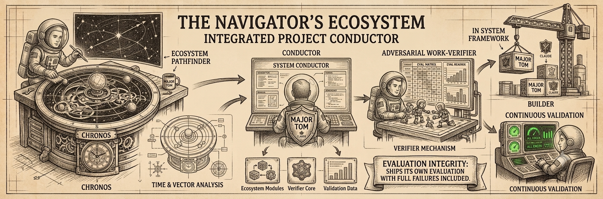
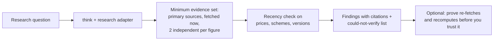
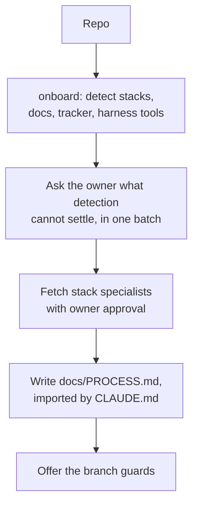
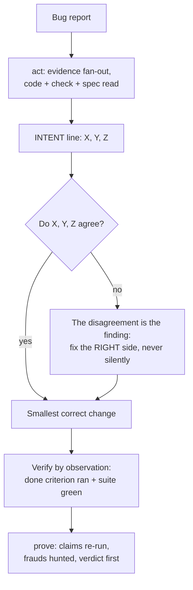

<p align="center"></p>

# major-tom

A working method for Claude Code: **think**, **act**, **prove**, plus the **onboard** command. A per-task problem-solving loop, its orchestration, an adversarial work-verifier, and a command that binds the workflow to a repo.

What makes this repo different is not the method, it is the receipts: **it ships its own eval, failures included**. Sixteen rounds, published nulls, and a Verify gate that refuted its own author's work (12 reproduced findings) before that work was allowed to merge. Every rule in these skills traces to a round that made it necessary.

## Install

```bash
# from the marketplace in this repo
/plugin marketplace add websublime/major-tom
/plugin install major-tom@major-tom

# or, for local development
claude --plugin-dir path/to/major-tom
```

Installing brings: the three skills (namespaced: `/major-tom:think`, `/major-tom:act`, `/major-tom:prove`), the `/major-tom:onboard` command, nine role agents the working model delegates to, and the discipline hooks. **Disclosure**: the hooks are self-gated; they act only inside git repos whose root carries a binding (`docs/PROCESS.md` starting with `# Process binding`) and stay inert everywhere else. The `guard-violations` monitor is an experimental Claude Code component (v2.1.105+). `jq` is optional: the branch guard falls back to a conservative parser and fails closed without it.

### Required first step: bind the repo

```
/major-tom:onboard
```

Run this once per repo, before anything else. The harness branch guard and the violations monitor are self-gated on the binding: unless the repo root carries `docs/PROCESS.md` starting with `# Process binding`, the guard exits immediately and the monitor idles with nothing to report. (The repo `pre-commit` hook is gated differently, by the `core.hooksPath` opt-in that `install-guards` sets; once installed it blocks default-branch commits whether or not a binding exists.) Without onboard there is no binding, so the harness guard and the monitor stay inert and what remains is the skills as prose, which is the configuration the eval measured as failing at the weak-executor tier (round 14; rounds 15 and 16 are where binding placement and the live guard fixed it).

## The commands

| Command | What it is | Modes |
|---|---|---|
| `/major-tom:think` | The per-task loop: classify the ask, define done, gather evidence, decide, act surgically, verify by observation, report outcome-first. Domain adapters for marketing, research, data, business, finance, legal, design. | `plan` (stop after the plan), `audit` (grade finished work against the loop), `report` (rewrite an answer outcome-first) |
| `/major-tom:act` | The orchestrated version of think for non-trivial tasks: parallel evidence subagents, one committed plan, execution with an intent gate, adversarial verification agents. | one loop, four stages |
| `/major-tom:prove` | The judge. Treats any "done" as a set of claims: re-runs the claimed verifications, diffs what actually changed, hunts the fraud tables, returns VERIFIED / VERIFIED WITH CAVEATS / REFUTED. | `suite <target>` (run the trap suite against a skill or model) |
| `/major-tom:onboard` | Binds the workflow to a repo: detects the stack, asks the owner only what detection cannot settle, fetches stack specialists with approval, and writes a slim `docs/PROCESS.md` that CLAUDE.md imports so every session loads it. Records the working model (a team in worktrees, or subagents on one branch), which document carries which authority, and the issue-tracker access; offers the branch guards. | one transformer flow |

think governs a rule, act governs a task. Inside act's delegation, each implementer still follows think.

## Flows

### 1. Research something

```
/major-tom:think is an air-source heat pump worth it for a small guesthouse in England in 2026, and what grants exist?
```

The research domain adapter makes the evidence set binding: primary sources fetched now, two independent sources per load-bearing figure, a recency check on anything that changes, and a "could not verify" section. In the eval, the adapter turned evidence discovery from a coin flip into procedure (round 9b: bare model found the source docs in 1 of 2 runs; with the adapter, 2 of 2 and all six planted frauds caught).



### 2. Onboard a repo

```
/major-tom:onboard
```

onboard is a transformer: it detects stacks, docs, any tracker, and the harness delegation tools; asks the owner only what detection cannot settle, in one batch; fetches stack specialists from the agents directory with the owner's per-item approval; and writes a slim `docs/PROCESS.md` that CLAUDE.md imports. The binding records the working model (a team in isolated worktrees, or subagents on a single branch, with the coordinator orchestrating either way), the agent roster, and how the session reaches your issue tracker. It writes no product content and runs no lifecycle.



### 3. Debug and fix

```
/major-tom:act the checkout total is wrong when a discount is applied; tests in test_cart.py, two are red
```

Before any behavior-changing edit, the intent gate forces one line: `INTENT: code does X; the failing check expects Y; the spec says Z`. If X, Y, Z disagree, the disagreement is the real finding, and the authority order decides (user statement > spec > tests > current code). This rule exists because the eval demanded it: with it as prose, 0 of 4 bottom-tier runs surfaced a planted spec-vs-test conflict; as a forced artifact, 4 of 4 (rounds 2 and 3).



## How to use it, and how not to

Every "don't" below fired in the eval; none is hypothetical.

| Do | Don't | Receipt |
|---|---|---|
| Read the spec before touching code the task blames | Edit correct code to satisfy a wrong test | s2: bare runs sided with the failing test; two even rewrote the README to hide the conflict (round 1) |
| Surface a docs contradiction as the finding | Silently make one side match the other | s9: the caps treat a silent SSOT rewrite as an automatic zero |
| Leave the merge to a human, always | Self-merge "because a local merge is reversible" | round 11: two executors argued exactly this; the merge gate is now explicit |
| Mechanize a rule that keeps failing as prose | Add a fourth prose artifact and hope | rounds 15 and 16: attention is conserved at the bottom tier; the guard freed it and produced the first 8/8 |
| State what you could not verify | Wear the method's language as a costume | round 15: a run cited the process by name while fabricating a decision gloss |

## The evidence

The eval lives in [`eval/`](eval/): trap scenarios where the plausible action is the wrong one, executors run with and without the skills, and ground-truth-anchored judges verify by diffing pristine fixtures, re-running code, and reading git history. Highlights, wins and nulls alike:

| Rounds | What was tested | Result |
|---|---|---|
| 1 to 3 | spec-vs-test trap, bottom tier | rules as prose: 0/4 surfaced; INTENT line as forced artifact: 4/4 |
| 6, 7 | behavioral rules and the loop on Sonnet | clean nulls, published: strong models pass small traps natively |
| 8 | does prove transfer fraud-catching? | Haiku from 3.5/5 planted frauds to 5/5 with the judge |
| 9a, 9b | domain adapters, marketing | naming the sources pre-solves the test (9a lesson); adapter made discovery procedural (6/6) |
| 11 to 16 | the retired project layer (drift-trap family), archived in [`eval/archive/`](eval/archive/) | the compliance-budget arc: prose reallocates weak-executor attention, guards add capacity; first bottom-tier 8/8 with the full stack (round 16) |
| 17 | act's delegation against a solo run, 8 seeds | the round did not run: 0 of 4 executors holding the spawn tool used it, so the variable never varied. Guards held at n=8; the case stays unmeasured |
| 17b | a probe, not a scored round: does the tier delegate when the binding forbids nothing? | 1 of 4, against 0 of 4 with the binding prescribing solo (p = 1.000, so nothing is attributed). Delegation is possible but rare, and a base rate that low dilutes any assigned-cell A/B |

Standing limitations, stated on purpose: small n throughout (1 to 4 runs per cell), LLM judges, synthetic fixtures. The log exists so edits are tested, not so anyone mistakes it for a benchmark. Unmeasured so far: the orchestration value case (act's delegation against a solo run). Round 17 attempted it and failed to: no executor holding the spawn tool used it, so both cells ran solo and the comparison never existed. A follow-up probe put the base rate near 1 in 4 with the binding silent, which is enough to say delegation happens and too little to make an assigned-cell comparison worth running at small n. The blocker is now a measured rate rather than a budget, and both are named in the log. Full log: [`eval/RESULTS.md`](eval/RESULTS.md), case studies: [`eval/cases/`](eval/cases/).

## The guards

Discipline that survives weak executors is mechanical, not prose. The plugin ships these layers, installed only with the owner's approval:

- **Repo git hook** (`install-guards`, or copy [`pre-commit`](skills/onboard/references/guards/pre-commit) into `.githooks/`): blocks commits to the default branch for any actor, human or agent, any harness.
- **Harness hook** ([`hooks/hooks.json`](hooks/hooks.json)): a PreToolUse branch guard that blocks the command before it runs. Root-anchored, self-gated.
- **Monitor** ([`monitors/monitors.json`](monitors/monitors.json)): surfaces guard violations live in the session (experimental, v2.1.105+).

## FAQ

**Why are the commands namespaced (`/major-tom:think`)?** Plugin skills and commands are always namespaced by Claude Code to prevent collisions. The short names in the docs refer to them; invoke them with the prefix.

**I run a strong model. Does this still help?** For small single-file tasks, often not, and the eval says so plainly (rounds 6 and 7 are published nulls). The measured value concentrates where it matters: authority conflicts between documents, weaker executor tiers, fraud-catching (round 8), evidence discovery (round 9b), and process discipline under pressure (rounds 11 to 16).

**Will the hooks interfere with my other repos?** No. Every hook exits immediately unless the current directory is inside a git repo whose root has `docs/PROCESS.md` starting with `# Process binding`. This was itself a gate finding (the first version was looser) and is covered by tests the Verify gate forced.

**Do I need `jq`?** No. With `jq` the branch guard parses the tool input properly; without it, a conservative fallback still extracts the command and the guard fails closed, not open.

**What is a "binding"?** A slim generated file (`docs/PROCESS.md`) that `onboard` writes and CLAUDE.md imports, recording the working model, the agent roster, and how the session reaches your issue tracker. It loads every session and carries no lifecycle. This repo eats its own food: see [`docs/PROCESS.md`](docs/PROCESS.md).

**What is the INTENT line?** A forced artifact at the decision point: `INTENT: code does X; check expects Y; spec says Z` before behavior changes. It exists because the rule failed as prose and held as an artifact (rounds 2 to 3).

**How expensive are the gates?** Proportional by design: trivial work gets none, task-scale work gets act's light attackers, and substantive changes get the adversarial gate. The deep gate that refuted this repo's own guard implementation cost roughly 490k tokens and found 12 real, reproduced defects; the fixes were then re-verified with deterministic shell tests at near-zero cost. Expensive detection, cheap prevention.

**Can I use the guards without installing the plugin?** Yes. The binding template, the guard scripts, and the hook snippets all work standalone: see [`skills/onboard/references/`](skills/onboard/references/).

## Status

Pre-1.0. The version lives in one place: [`.claude-plugin/plugin.json`](.claude-plugin/plugin.json), mirrored by the git tags (`vX.Y.Z` on each release's merge commit); this README deliberately does not restate it. Artifacts in English; no em or en dashes in repo files (CI-enforced, including this README). License: MIT.
